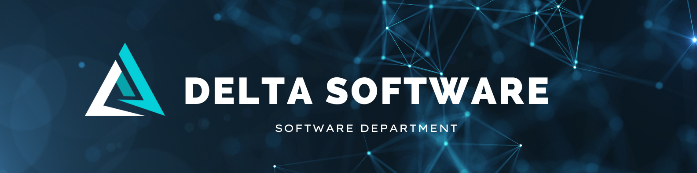

<!-- Se agrega el banner con la imagen Banner.png en la carpeta images, misma que está dentro de la carpeta .vscode  -->

<h1 align="center">Hola 👋, nosotros somos Delta</h1>
<h3 align="center">Somos un grupo de desarrolladores jr. comprometidos y enfocados a brindar soluciones de valor a nuestros socios a través de medios tecnológicos y, de esta manera, ayudarlos a lograr sus objetivos de una manera ágil ofreciendo nuestra creatividad y conocimientos</h3>

<h2 align="left">Misión:</h2> 
Delta nace de la pasión y el compromiso por la tecnología y de ofrecer una alta calidad a las soluciones propuestas en el desarrollo de software, esforzándonos en seguir aprendiendo, avanzando y creciendo en el proceso, dando una experiencia personalizada a nuestros socios.

<h2 align="left">Visión:</h2> 
Ofrecer soluciones flexibles cumpliendo estándares profesionales internacionales con el fin de garantizar calidad. 

  

&nbsp;

